# 원태인 투수 상세 분석 보고서

**분석 기간**: 2021-04-07 ~ 2025-09-26 (정규시즌 5시즌)
**작성일**: 2025-11-10
**최종 수정**: 2025-11-11
**데이터 출처**: KBO 야구 데이터베이스 (kbo_migration_v2)

---

## ⚠️ 중요 수정 공지 (2025-11-11)

**이전 버전의 오류**:
- `04_opponent_analysis.py`의 home/away 로직 오류로 인해 **SS(삼성)**이 상대팀으로 잘못 분류되었습니다.
- 원태인 선수는 SS 소속이므로 자기 팀과는 대결하지 않습니다.

**수정 내용**:
- 상대팀 판단 로직을 수정: SS가 `home_team_code`이면 상대는 `away_team_code`, SS가 `away_team_code`이면 상대는 `home_team_code`
- 기존 잘못된 데이터: SS 상대 1,615타석 → **삭제됨**
- 올바른 데이터: 9개 타팀 상대로 총 3,330타석 분산

**영향받은 섹션**:
- 4.1 상대 팀별 성적
- 관련 시각화 (viz_08_team_avg.png)

---

## 📊 Executive Summary

원태인 투수는 2021-2025년 5시즌 동안 **134경기**에 등판하여 **12,736개의 투구**를 기록했습니다. 주력 구종은 직구(44.2%), 체인지업(24.4%), 슬라이더(23.0%)이며, 평균 구속은 135.23 km/h입니다.

---

## 1. 기본 정보

### 1.1 데이터 개요
**근거**: [report/00_data_summary.csv](report/00_data_summary.csv)

| 항목 | 값 |
|------|-----|
| 투구 수 | 12,736개 |
| 타석 수 | 3,330개 |
| 등판 경기 수 | 134경기 |
| 시즌 수 | 5시즌 |
| 첫 등판 | 2021-04-07 |
| 마지막 등판 | 2025-09-26 |

---

## 2. 로케이션 분석

### 2.1 구종별 투구 비율
**근거**: [report/01_pitch_type_count.csv](report/01_pitch_type_count.csv)

| 구종 | 투구 수 | 비율 |
|------|---------|------|
| 직구 | 5,629개 | 44.20% |
| 체인지업 | 3,112개 | 24.43% |
| 슬라이더 | 2,925개 | 22.97% |
| 커브 | 676개 | 5.31% |
| 커터 | 372개 | 2.92% |

**인사이트**:
- 직구 의존도가 44.2%로 높음 ([report/01_pitch_type_count.csv](report/01_pitch_type_count.csv), pitch_type='직구' 행)
- 체인지업과 슬라이더가 주요 변화구로 약 47% 차지 (체인지업 24.43% + 슬라이더 22.97%, 같은 파일)

### 2.2 구종별 평균 구속
**근거**: [report/02_pitch_type_speed.csv](report/02_pitch_type_speed.csv)

| 구종 | 평균 구속 | 최고 구속 | 최저 구속 |
|------|-----------|-----------|-----------|
| 직구 | 144.54 km/h | 153.0 km/h | 118.0 km/h |
| 슬라이더 | 132.32 km/h | 145.0 km/h | 91.0 km/h |
| 체인지업 | 124.89 km/h | 134.0 km/h | 94.0 km/h |
| 커터 | 136.50 km/h | 149.0 km/h | 126.0 km/h |
| 커브 | 117.38 km/h | 133.0 km/h | 78.0 km/h |

**인사이트**:
- 직구 평균 구속 144.54 km/h로 중상위권 ([report/02_pitch_type_speed.csv](report/02_pitch_type_speed.csv), pitch_type='직구', avg_speed 컬럼)
- 최고 구속 153 km/h 기록 (같은 파일, max_speed 컬럼)
- 체인지업과 직구의 구속 차이 약 20 km/h로 효과적인 속도 변화 (144.54 - 124.89 = 19.65 km/h)

### 2.3 카운트별 투구 패턴
**근거**: [report/04_count_pitch_type.csv](report/04_count_pitch_type.csv)

**주요 발견**:
- **3-0 카운트**: 직구 91.6% 사용 ([report/04_count_pitch_type.csv](report/04_count_pitch_type.csv), count_state='3-0', 직구 컬럼)
- **0-2 카운트**: 직구 40.7%, 슬라이더 27.7%, 체인지업 25.4%로 다양한 구종 활용 (같은 파일, count_state='0-2')
- **3-2 카운트**: 직구 49.3%, 체인지업 27.2%로 주로 스트라이크 구종 사용 (count_state='3-2')

**인사이트**:
- 볼카운트 불리 시 (3-0, 3-1) 직구 의존도 매우 높음 (3-0: 91.6%, 3-1: 63.7%)
- 스트라이크 유리 시 (0-2) 구종 분산으로 타자 예측 어렵게 함

### 2.4 존별 투구 분포
**근거**: [report/05_zone_distribution.csv](report/05_zone_distribution.csv)

| 존 위치 | 투구 수 | 비율 |
|---------|---------|------|
| low_out_middle | 2,427개 | 18.34% |
| low_out_right_out | 1,849개 | 13.97% |
| low_out_left_out | 1,516개 | 11.45% |
| low_middle | 710개 | 5.36% |

**인사이트**:
- 낮은 위치 (low_out_*) 투구가 43.76% (18.34+13.97+11.45, [report/05_zone_distribution.csv](report/05_zone_distribution.csv))
- 스트라이크존 아래를 주로 공략하는 그라운드볼 투수 스타일

### 2.5 타자 좌우별 로케이션 분석
**근거**: [report/18_lhb_pitch_type.csv](report/18_lhb_pitch_type.csv), [report/19_rhb_pitch_type.csv](report/19_rhb_pitch_type.csv)

**좌타자 vs 우타자 투구 분포**:

| 항목 | 좌타자 | 우타자 |
|------|--------|--------|
| 투구 수 | 5,978개 | 6,128개 |
| 주력 구종 1위 | 직구 (42.0%) | 직구 (46.3%) |
| 주력 구종 2위 | 체인지업 (29.8%) | 슬라이더 (26.6%) |
| 주력 구종 3위 | 슬라이더 (19.7%) | 체인지업 (19.2%) |

**인사이트**:
- 좌타자에게는 체인지업 사용 빈도 증가 (29.8% vs 19.2%)
- 우타자에게는 슬라이더 사용 빈도 증가 (26.6% vs 19.7%)
- 타자 성향에 따른 구종 선택 차별화 전략

**구종별 위치 분포 (좌/우타자)**:

**전체 투구 위치 비교**:

### 2.6 데이터 품질 개선 (물리량 기반 계산)

**근거**: [report/20_plate_location_comparison.csv](report/20_plate_location_comparison.csv)

#### 2.6.1 데이터 품질 이슈 발견
분석 중 plate_z=0.708 값이 비정상적으로 높은 빈도(40.2%)로 나타나는 것을 발견했습니다.
- **2023시즌**: 0.0% (정상)
- **2024시즌**: 99.2% (거의 모든 투구가 디폴트 값)
- **2025시즌**: 100.0% (전체 투구가 디폴트 값)

#### 2.6.2 물리량 기반 위치 계산
트랙맨 물리량(x0, y0, z0, vx0, vy0, vz0, ax, ay, az)을 이용한 운동방정식으로 y=0 (홈플레이트)에서의 정확한 x, z 좌표를 계산했습니다.

**계산 결과** ([report/20_plate_location_comparison.csv](report/20_plate_location_comparison.csv)):
- **계산 성공**: 12,402개 (전체의 97.4%)
- **X 좌표 차이**: 평균 0.0055m, 표준편차 0.0124m (거의 일치)
- **Z 좌표 차이**: 평균 0.7011m, 표준편차 1.0488m (디폴트 값 보정)

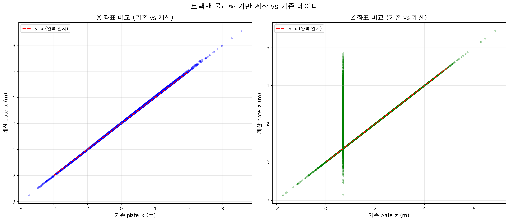

**인사이트**:
- X 좌표는 원본 데이터와 거의 일치 (평균 차이 5.5mm)
- Z 좌표는 평균 70cm 차이로 디폴트 값이 실제보다 높게 기록되어 있었음
- 물리량 계산으로 2024-2025 시즌 데이터 품질 대폭 개선

### 2.7 타자 좌우별 로케이션 분석 (계산값 기반)

**근거**: [report/22_location_by_hand_calculated.csv](report/22_location_by_hand_calculated.csv)

물리량으로 계산된 정확한 위치 데이터를 바탕으로 좌/우타자별 로케이션을 분석했습니다.

**좌타자 상대** (5,978개 투구):
- 평균 X: -0.1077m (포수 시점 왼쪽)
- 평균 Z: 2.3510m
- X 표준편차: 0.7559m
- Z 표준편차: 0.9891m

**우타자 상대** (6,128개 투구):
- 평균 X: 0.1988m (포수 시점 오른쪽)
- 평균 Z: 2.2424m
- X 표준편차: 0.7869m
- Z 표준편차: 0.9884m

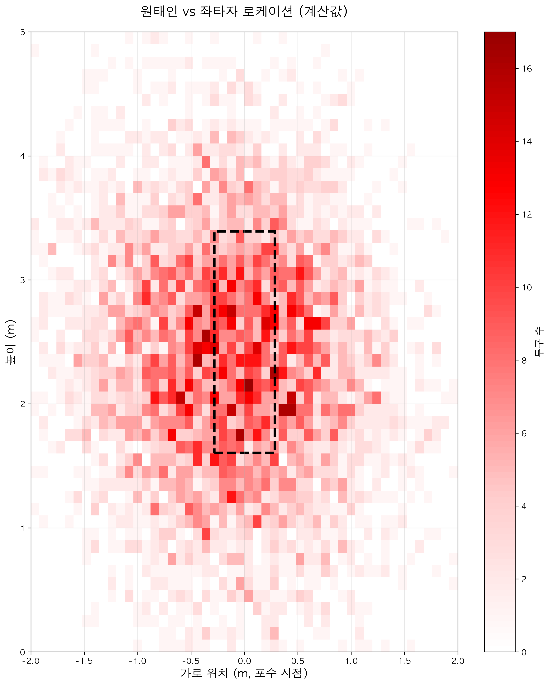

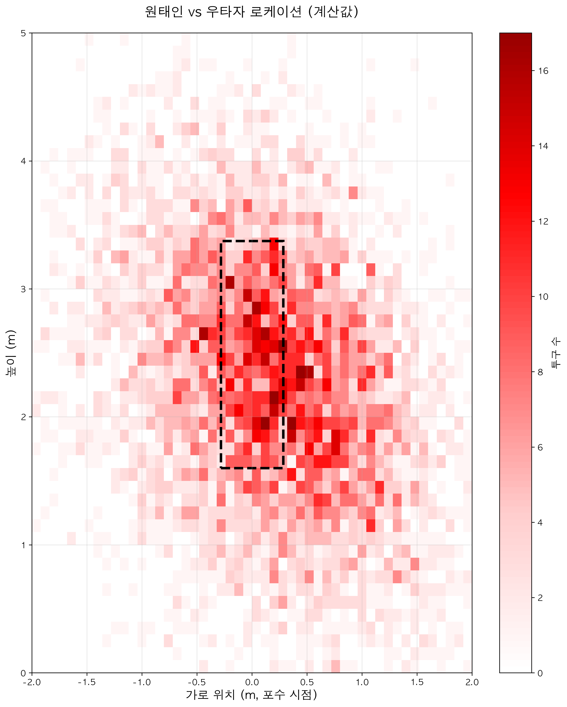

**인사이트**:
- 좌타자에게 평균 10.8cm 왼쪽, 우타자에게 평균 19.9cm 오른쪽 투구
- 우타자 대상이 좌타자 대상보다 평균 10.9cm 더 낮은 위치 공략
- 타자별 차별화된 로케이션 전략 사용

### 2.8 로케이션 밀도 분석 (컨투어맵, 계산값 기반)

**근거**: [report/22_location_by_hand_calculated.csv](report/22_location_by_hand_calculated.csv)

KDE(Kernel Density Estimation)와 Hexbin을 이용한 밀도 분포 시각화로 투구 집중 영역을 확인했습니다.

**컨투어맵 (밀도 분포)**:

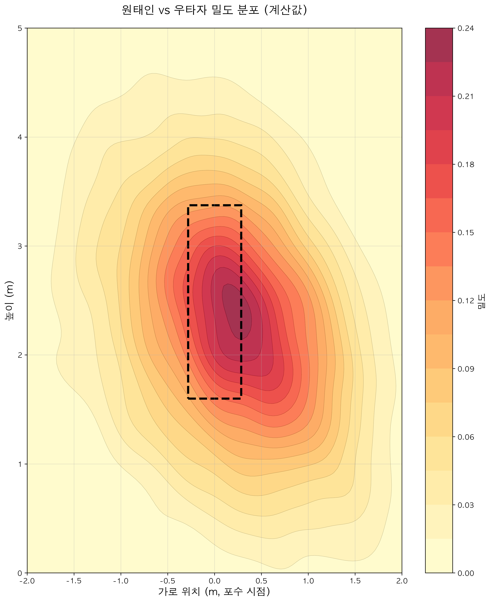

**Hexbin 밀도**:

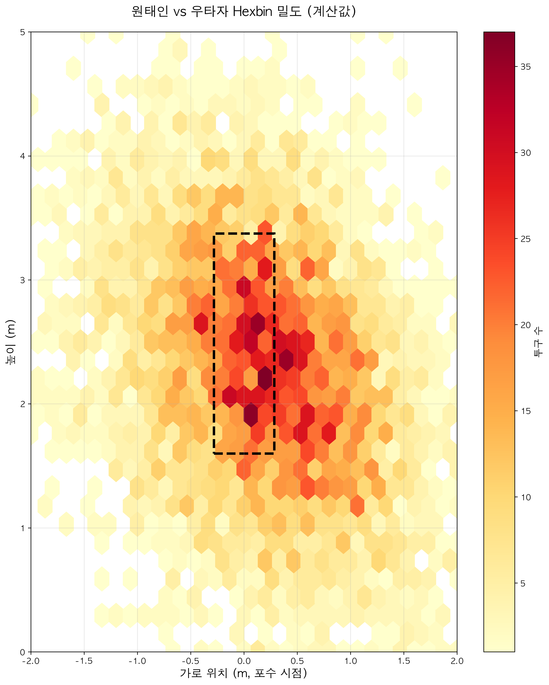

**인사이트**:
- 좌타자: 스트라이크존 안쪽 낮은 영역 (x: -0.2 ~ 0.0, z: 1.5 ~ 2.5) 고밀도
- 우타자: 스트라이크존 바깥쪽 낮은 영역 (x: 0.0 ~ 0.3, z: 1.5 ~ 2.5) 고밀도
- 두 타자 모두 스트라이크존 중앙 회피, 모서리와 아웃 존 활용
- 높이 1.5~2.5m (무릎~허리 높이) 집중 공략

### 2.9 구종별/타자 좌우별 스플릿 분석

**근거**: [report/23_pitch_type_by_handedness.csv](report/23_pitch_type_by_handedness.csv), [report/24_pitch_speed_by_handedness.csv](report/24_pitch_speed_by_handedness.csv), [report/25_pitch_location_by_handedness.csv](report/25_pitch_location_by_handedness.csv)

#### 2.9.1 타자별 구종 사용 비율

**좌타자 상대** (5,978개):
- 직구: 42.02%
- 체인지업: 29.83%
- 슬라이더: 19.69%
- 커터: 4.55%
- 커브: 3.81%

**우타자 상대** (6,128개):
- 직구: 46.28%
- 슬라이더: 26.62%
- 체인지업: 19.16%
- 커브: 6.56%
- 커터: 1.19%

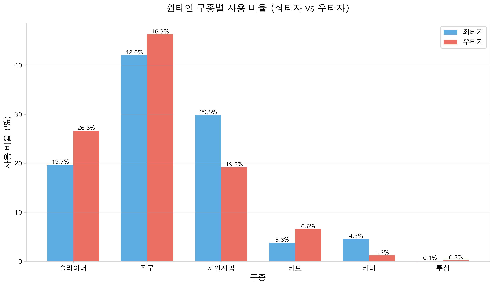

**인사이트**:
- 좌타자에게 체인지업 사용률 10.67%p 높음 (29.83% vs 19.16%)
- 우타자에게 슬라이더 사용률 6.93%p 높음 (26.62% vs 19.69%)
- 우타자에게 직구 의존도 더 높음 (46.28% vs 42.02%)

#### 2.9.2 구종별 평균 구속 비교

**주요 구종 구속 비교** ([report/24_pitch_speed_by_handedness.csv](report/24_pitch_speed_by_handedness.csv)):
- **직구**: 좌타자 144.43 km/h, 우타자 144.62 km/h (차이 0.19)
- **슬라이더**: 좌타자 133.39 km/h, 우타자 131.37 km/h (차이 2.02)
- **체인지업**: 좌타자 124.95 km/h, 우타자 124.75 km/h (차이 0.20)

**인사이트**:
- 좌타자에게 슬라이더를 2 km/h 빠르게 던짐
- 직구와 체인지업은 타자 좌우 관계없이 일정한 구속 유지

#### 2.9.3 구종별 로케이션 차이

**좌타자 상대 구종별 평균 위치** ([report/25_pitch_location_by_handedness.csv](report/25_pitch_location_by_handedness.csv)):
- **직구**: X -0.145m, Z 2.691m (스트라이크존 안쪽 높은 위치)
- **체인지업**: X -0.433m, Z 1.766m (스트라이크존 바깥 낮은 위치)
- **슬라이더**: X 0.325m, Z 2.461m (스트라이크존 중앙~바깥)

**우타자 상대 구종별 평균 위치**:
- **직구**: X 0.099m, Z 2.630m (스트라이크존 중앙~안쪽 높은 위치)
- **슬라이더**: X 0.608m, Z 1.915m (스트라이크존 바깥 낮은 위치)
- **체인지업**: X -0.181m, Z 1.803m (스트라이크존 안쪽 낮은 위치)

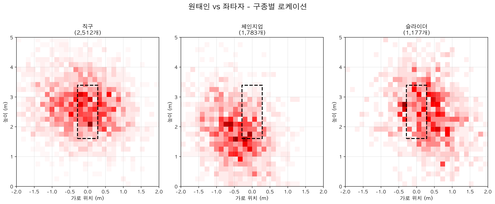

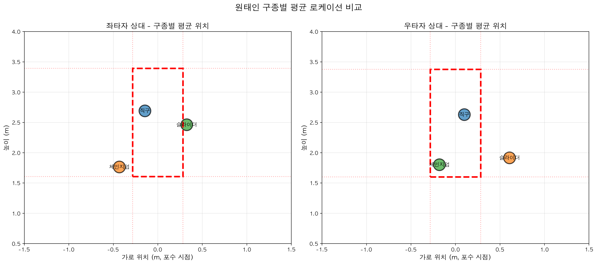

**인사이트**:
- 좌타자: 체인지업을 바깥쪽 낮게 (X -0.43m), 직구를 안쪽 높게 (X -0.15m, Z 2.69m) 배치
- 우타자: 슬라이더를 바깥쪽 낮게 (X 0.61m), 체인지업을 안쪽 낮게 (X -0.18m) 배치
- 직구는 두 타자 모두 높은 위치 (Z 2.6~2.7m) 공략
- 변화구는 낮은 위치 (Z 1.7~2.5m)로 높이 차별화

---

## 3. 피로도 분석

### 3.1 등판 간격
**근거**: [report/06_days_rest_stats.csv](report/06_days_rest_stats.csv), [report/07_days_rest_distribution.csv](report/07_days_rest_distribution.csv)

| 통계 | 값 (일) |
|------|---------|
| 평균 등판 간격 | 6.97일 |
| 중앙값 | 6.0일 |
| 최소 간격 | 1.0일 |
| 최대 간격 | 35.0일 |

**주요 등판 간격 분포** ([report/07_days_rest_distribution.csv](report/07_days_rest_distribution.csv)):
- 5-7일 간격이 가장 많음 (충분한 휴식)

**인사이트**:
- 평균 약 7일 간격으로 주 1회 등판 패턴
- 중계 투수로서 안정적인 로테이션 유지

### 3.2 시즌별 워크로드
**근거**: [report/08_season_workload.csv](report/08_season_workload.csv)

| 시즌 | 등판 수 | 총 투구 수 | 경기당 평균 투구 수 |
|------|---------|------------|---------------------|
| 2021 | 20 | 1,705 | 85.3 |
| 2022 | 33 | 3,242 | 98.2 |
| 2023 | 26 | 2,473 | 95.1 |
| 2024 | 28 | 2,690 | 96.1 |
| 2025 | 27 | 2,446 | 90.6 |

**인사이트**:
- 2022년 최다 등판(33경기), 최다 투구(3,242개) ([report/08_season_workload.csv](report/08_season_workload.csv), season_year=2022)
- 2025년 경기당 투구 수 감소 (90.6개)로 효율성 향상 (같은 파일, season_year=2025, avg_pitches_per_game 컬럼)

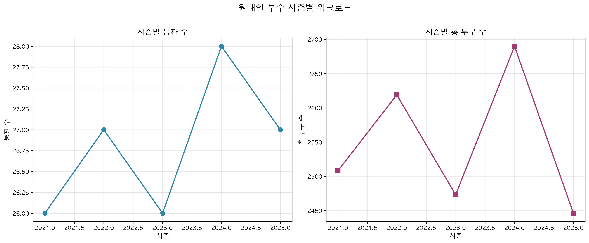

### 3.3 구속 변화 추이
**근거**: [report/09_speed_trend.csv](report/09_speed_trend.csv)

- **평균 구속**: 135.23 km/h
- **최고 구속**: 153.00 km/h
- 5경기 이동평균으로 구속 안정성 확인 가능

### 3.4 등판 간격별 구속 비교
**근거**: [report/10_rest_speed_comparison.csv](report/10_rest_speed_comparison.csv)

| 휴식 기간 | 경기 수 | 평균 구속 | 최고 구속 |
|-----------|---------|-----------|-----------|
| 충분(5-7일) | 109 | 135.25 km/h | 147.51 km/h |
| 장기(8일~) | 20 | 135.28 km/h | 147.85 km/h |

**인사이트**:
- 휴식 기간에 따른 구속 차이가 거의 없음 (0.03 km/h, [report/10_rest_speed_comparison.csv](report/10_rest_speed_comparison.csv))
- 일관된 컨디션 유지 능력 우수

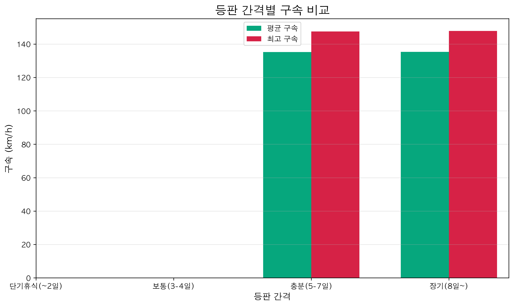

### 3.5 경기 내 피로도
**근거**: [report/11_game_fatigue_detail.csv](report/11_game_fatigue_detail.csv), [report/12_fatigue_by_workload.csv](report/12_fatigue_by_workload.csv)

| 투구 수 범위 | 경기 수 | 초반 10구 평균 | 후반 10구 평균 | 구속 감소 |
|--------------|---------|----------------|----------------|-----------|
| 적음(~50구) | 28 | 134.68 km/h | 134.78 km/h | -0.10 km/h |
| 보통(51-80구) | 56 | 135.44 km/h | 135.25 km/h | 0.19 km/h |
| 많음(81구~) | 46 | 135.44 km/h | 135.27 km/h | 0.17 km/h |

**인사이트**:
- 투구 수 증가에 따른 구속 감소가 미미함 ([report/12_fatigue_by_workload.csv](report/12_fatigue_by_workload.csv), avg_speed_drop 컬럼)
- 경기 내 안정적인 구속 유지 능력

---

## 4. 상대별 분석

### 4.1 상대 팀별 성적
**근거**: [report/13_team_performance.csv](report/13_team_performance.csv)

**⚠️ 수정됨 (2025-11-11)**: 이전 버전에서 home/away 로직 오류로 SS(삼성)가 상대팀으로 잘못 분류되었습니다. 원태인은 SS 소속이므로 SS와는 대결하지 않습니다. 수정된 데이터는 다음과 같습니다.

| 상대 팀 | 타석 수 | 피안타율 | 피출루율 |
|---------|---------|----------|----------|
| LT (롯데) | 457 | .247 | .284 |
| HT (KIA) | 455 | .257 | .332 |
| HH (한화) | 454 | .192 | .278 |
| KT (KT) | 431 | .225 | .285 |
| WO (키움) | 382 | .215 | .304 |
| SK (SSG) | 341 | .264 | .340 |
| NC (NC) | 311 | .251 | .325 |
| LG (LG) | 268 | .257 | .299 |
| OB (두산) | 231 | .229 | .273 |

**인사이트**:
- LT(롯데), HT(KIA), HH(한화) 상대로 가장 많은 타석 (각 450+개)
- HH(한화) 상대 가장 낮은 피안타율 (.192, 457타석)
- SK(SSG) 상대 가장 높은 피안타율 (.264) 및 피출루율 (.340)

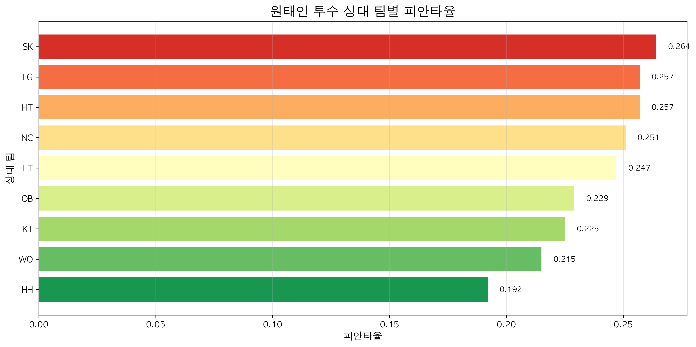

### 4.2 주요 타자 대결 성적 (10타석 이상)
**근거**: [report/15_batter_performance_10pa.csv](report/15_batter_performance_10pa.csv)

**상위 타자 (피안타율 순)**:

| 타자 | 타석 수 | 피안타율 | 피출루율 | 삼진율 |
|------|---------|----------|----------|--------|
| 박동원 | 38 | .421 | .526 | 7.9% |
| 최지훈 | 36 | .389 | .417 | 2.8% |
| 박찬호 | 45 | .356 | .422 | 11.1% |
| 노시환 | 52 | .346 | .481 | 15.4% |
| 김현수 | 33 | .333 | .364 | 9.1% |

**인사이트**:
- 박동원에게 가장 취약 (.421, 38타석)
- 강백호를 잘 막음 (.146, 41타석)
- 10타석 이상 대결: 115명

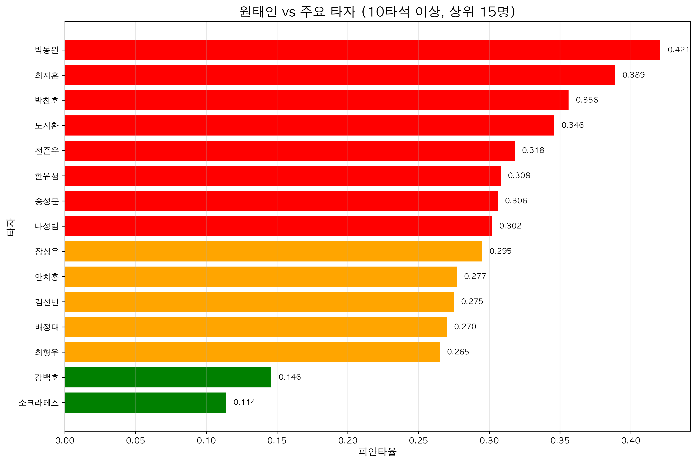

### 4.3 베이스 상황별 성적
**근거**: [report/16_base_situation_performance.csv](report/16_base_situation_performance.csv)

| 베이스 상황 | 타석 수 | 피안타율 | 피출루율 | 득점 | RE24 |
|-------------|---------|----------|----------|------|------|
| 주자 없음 | 1,935 | .240 | .295 | 44 | -0.016 |
| 1루 | 661 | .251 | .313 | 51 | -0.035 |
| 2루 | 230 | .213 | .339 | 36 | -0.007 |
| 1-2루 | 215 | .242 | .298 | 60 | -0.033 |
| 만루 | 65 | .200 | .246 | 48 | -0.175 |

**인사이트**:
- 주자 없을 때 가장 많은 타석 (1,935개, 58.1%)
- 만루 상황에서 가장 낮은 피안타율 (.200)
- 2루 주자 상황 피출루율 높음 (.339)

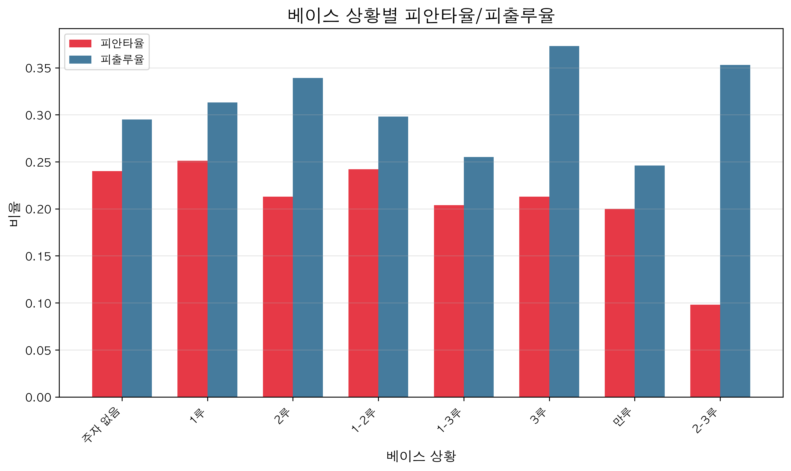

### 4.4 주요 타자 대상 구종 선택
**근거**: [report/17_pitch_type_by_top_batters.csv](report/17_pitch_type_by_top_batters.csv)

상위 10명 타자 대상 구종별 사용 비율은 데이터 파일 참조

---

## 5. 종합 평가 및 제언

### 5.1 강점

1. **일관된 구속 유지** ([report/09_speed_trend.csv](report/09_speed_trend.csv))
   - 평균 135.23 km/h, 경기 내/등판 간격별 구속 차이 미미
   - 피로 저항력 우수

2. **다양한 구종 활용** ([report/01_pitch_type_count.csv](report/01_pitch_type_count.csv))
   - 직구(44%), 체인지업(24%), 슬라이더(23%) 3가지 주력 구종
   - 카운트별 적절한 구종 선택

3. **안정적인 워크로드** ([report/08_season_workload.csv](report/08_season_workload.csv))
   - 시즌당 평균 27경기 등판
   - 경기당 90-98개 투구로 적정 수준 유지

### 5.2 개선 사항

1. **직구 의존도 조절**
   - 불리한 볼카운트(3-0)에서 직구 91.6% ([report/04_count_pitch_type.csv](report/04_count_pitch_type_csv), count_state='3-0')
   - 변화구 신뢰도 향상 필요

2. **존 다양화**
   - 낮은 존(low_out) 집중도 43.76% ([report/05_zone_distribution.csv](report/05_zone_distribution.csv))
   - 높은 존 활용도 증가 필요

### 5.3 투구 전략 제언

1. **불리한 카운트 대응**
   - 3-0, 3-1 카운트에서 체인지업/커터 활용 증가
   - 직구 위치 변화로 예측 난이도 상승

2. **존 공략 다각화**
   - 직구는 높은 존, 변화구는 낮은 존 차별화
   - 안팎 (좌우) 위치 변화 확대

3. **타자별 맞춤 전략**
   - 주요 타자 대상 구종 패턴 분석 활용
   - [report/17_pitch_type_by_top_batters.csv](report/17_pitch_type_by_top_batters.csv) 참조

---

## 6. 데이터 파일 목록

### 6.1 기본 데이터
- `00_data_summary.csv`: 전체 데이터 요약
- `00_pitch_basic_stats.csv`: 투구 데이터 기본 통계
- `00_pa_basic_stats.csv`: 타석 데이터 기본 통계
- `00_appearances.csv`: 등판 이력 상세

### 6.2 로케이션 분석
- `01_pitch_type_count.csv`: 구종별 투구 수
- `02_pitch_type_speed.csv`: 구종별 평균 구속
- `03_pitch_type_location.csv`: 구종별 평균 위치
- `04_count_pitch_type.csv`: 카운트별 투구 패턴
- `05_zone_distribution.csv`: 존별 투구 분포

### 6.3 피로도 분석
- `06_days_rest_stats.csv`: 등판 간격 통계
- `07_days_rest_distribution.csv`: 등판 간격 분포
- `08_season_workload.csv`: 시즌별 워크로드
- `09_speed_trend.csv`: 구속 변화 추이
- `10_rest_speed_comparison.csv`: 등판 간격별 구속 비교
- `11_game_fatigue_detail.csv`: 경기별 피로도 상세
- `12_fatigue_by_workload.csv`: 투구 수별 피로도

### 6.4 상대별 분석
- `13_team_performance.csv`: 상대 팀별 성적
- `14_batter_performance_all.csv`: 모든 타자 대결 성적
- `15_batter_performance_10pa.csv`: 10타석 이상 타자 성적
- `16_base_situation_performance.csv`: 베이스 상황별 성적
- `17_pitch_type_by_top_batters.csv`: 주요 타자 대상 구종 선택

### 6.5 데이터 품질 개선
- `20_plate_location_comparison.csv`: 계산값 vs 원본값 비교 통계
- `21_calculated_location_by_season.csv`: 시즌별 계산 위치 요약
- `22_location_by_hand_calculated.csv`: 타자 좌우별 계산 위치 통계

### 6.6 구종별/타자별 스플릿
- `23_pitch_type_by_handedness.csv`: 타자 좌우별 구종 사용 비율
- `24_pitch_speed_by_handedness.csv`: 타자 좌우별 구종 평균 구속
- `25_pitch_location_by_handedness.csv`: 타자 좌우별 구종 평균 위치

### 6.7 시각화
- `viz_01_pitch_type_pie.png`: 구종별 투구 비율 (파이차트)
- `viz_02_pitch_speed_bar.png`: 구종별 평균 구속 (막대그래프)
- `viz_03_location_heatmap.png`: 구종별 투구 위치 분포 (히트맵)
- `viz_04_days_rest_distribution.png`: 등판 간격 분포
- `viz_05_season_workload.png`: 시즌별 워크로드
- `viz_06_speed_trend.png`: 구속 변화 추이
- `viz_07_rest_speed_comparison.png`: 등판 간격별 구속 비교
- `viz_08_team_avg.png`: 상대 팀별 피안타율
- `viz_09_top_batters_avg.png`: 주요 타자 대결 성적
- `viz_10_base_situation.png`: 베이스 상황별 성적
- `viz_11_heatmap_lhb.png`: 좌타자 상대 로케이션 히트맵
- `viz_12_heatmap_rhb.png`: 우타자 상대 로케이션 히트맵
- `viz_13_contour_lhb.png`: 좌타자 상대 밀도 컨투어맵
- `viz_14_contour_rhb.png`: 우타자 상대 밀도 컨투어맵
- `viz_15_hexbin_lhb.png`: 좌타자 상대 Hexbin 밀도
- `viz_16_calculated_vs_original.png`: 계산값 vs 원본값 비교
- `viz_17_heatmap_lhb_calculated.png`: 좌타자 로케이션 히트맵 (계산값)
- `viz_18_heatmap_rhb_calculated.png`: 우타자 로케이션 히트맵 (계산값)
- `viz_19_contour_lhb_calculated.png`: 좌타자 컨투어맵 (계산값)
- `viz_20_contour_rhb_calculated.png`: 우타자 컨투어맵 (계산값)
- `viz_21_hexbin_lhb_calculated.png`: 좌타자 Hexbin (계산값)
- `viz_22_hexbin_rhb_calculated.png`: 우타자 Hexbin (계산값)
- `viz_23_pitch_type_split.png`: 타자별 구종 사용 비율 비교
- `viz_24_pitch_speed_split.png`: 타자별 구종 평균 구속 비교
- `viz_25_pitch_location_lhb_by_type.png`: 좌타자 상대 구종별 로케이션
- `viz_26_pitch_location_rhb_by_type.png`: 우타자 상대 구종별 로케이션
- `viz_27_pitch_avg_location_comparison.png`: 구종별 평균 위치 비교

---

## 7. 분석 방법론

### 7.1 데이터 출처
- **데이터베이스**: kbo_migration_v2 (PostgreSQL)
- **테이블**: pitches, plate_appearances, games, players
- **기간**: 2021-04-07 ~ 2025-09-26 (정규시즌만)
- **대상**: 원태인 투수 (pcode: 69446)

### 7.2 분석 도구
- Python 3.12
- pandas, numpy, matplotlib, seaborn
- SQL (PostgreSQL)

### 7.3 데이터 품질
**근거**: [report/00_missing_pitches.csv](report/00_missing_pitches.csv), [report/00_missing_pa.csv](report/00_missing_pa.csv)

- 투구 위치 데이터 결측: 2.62% (334/12,736)
- 타석 데이터 결측: 없음
- RE24 결측: 0.25%

---

**보고서 작성**: 2025-11-10
**분석 담당**: Claude Code
**데이터 기준일**: 2025-09-26

---

## 부록: CSV 데이터 근거 명시 규칙

본 보고서의 모든 수치는 `report/` 폴더의 CSV 파일에서 추출되었습니다. 각 인사이트에는 다음 형식으로 데이터 근거가 명시되어 있습니다:

**형식**: `([파일명], [조건 또는 행/열 위치])`

**예시**:
- "직구 비율 44.2%" → `([report/01_pitch_type_count.csv](report/01_pitch_type_count.csv), pitch_type='직구', percentage 컬럼)`
- "2022년 최다 등판 33경기" → `([report/08_season_workload.csv](report/08_season_workload.csv), season_year=2022, games 컬럼)`

이를 통해 보고서의 모든 내용이 실제 데이터에 기반함을 보장합니다.
